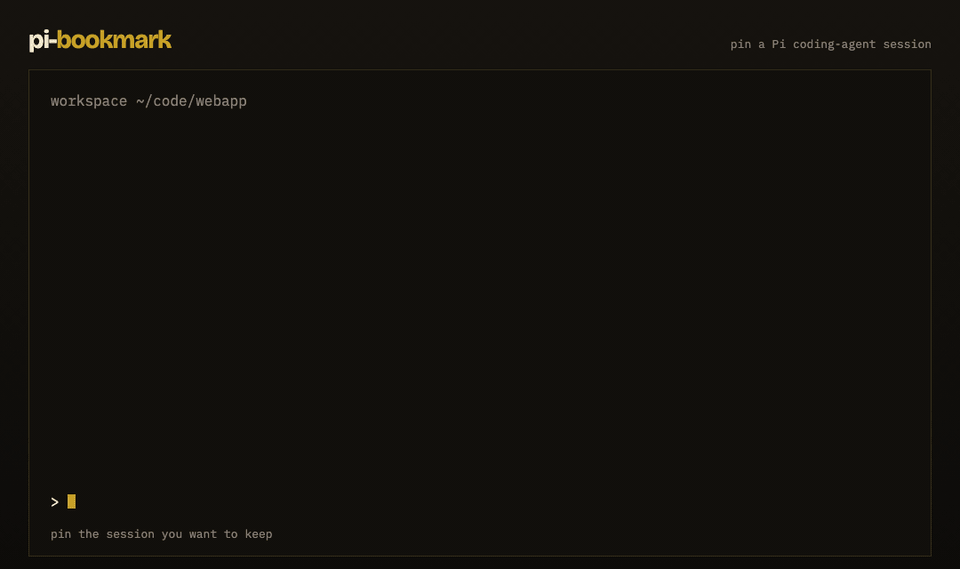

# pi-bookmark

**pi-bookmark** is a [Pi coding agent](https://pi.dev) extension (`pi-package`) that **pins important Pi sessions** so you can **bookmark and resume** them from any workspace.

Pi’s built-in `/resume` lists every session you ever started. After a week that list is noise. pi-bookmark keeps a short, global pin list of the threads you actually want again.

[](https://github.com/vaultboy001/pi-bookmark)

[](https://github.com/vaultboy001/pi-bookmark)

```bash
pi install npm:pi-bookmark
```

Then `/reload` or restart Pi.

Also known as: pin a Pi session, bookmark a Pi coding-agent session, favorite / star a Pi conversation, `/pin` `/unpin` `/bookmarks`.

## Install

**From npm** (Pi package gallery):

```bash
pi install npm:pi-bookmark
```

**From git:**

```bash
pi install git:github.com/vaultboy001/pi-bookmark
```

**Try once without installing:**

```bash
pi -e npm:pi-bookmark
```

Requires [Pi coding agent](https://www.npmjs.com/package/@earendil-works/pi-coding-agent) (`pi` on your PATH). Node `>= 22.19`.

## Commands

| Command | What it does |
| --- | --- |
| `/pin [note]` | Pin (bookmark) the current Pi session |
| `/pin` | If already pinned, open the bookmark picker |
| `/unpin` | Unpin this session |
| `/bookmarks [query]` | `/resume`-style picker of pinned sessions |
| `/pin list` | Same as `/bookmarks` |
| `/pin rm` | Same as `/unpin` |
| `/pin prune` | Drop pins whose session files are gone |
| `ctrl+shift+b` | Toggle pin on this session |

The model can call the `pin_session` tool (`add` / `remove` / `list`) when you ask it to pin a session. It will not pin on its own.

## Picker

`/bookmarks` uses the same picker chrome as Pi `/resume` (SelectList + DynamicBorder, not a floating overlay).

| Key | Action |
| --- | --- |
| type | filter |
| `↑` `↓` | move |
| `enter` | resume the selected session |
| `tab` | this folder / all |
| `ctrl+d` | unpin |
| `ctrl+r` | edit note |
| `esc` | close |

Current session is marked `★`. Missing files are marked `✕` and cannot be opened. A footer status `★ …` shows when the session you are in is pinned.

## Storage

Pins are **global**, not per-project:

```text
~/.pi/agent/pi-bookmark/bookmarks.json
```

Honors `PI_CODING_AGENT_DIR`. **Session JSONL files are never modified.**

## How this compares

| Need | Use |
| --- | --- |
| Pin a few important Pi sessions and jump back | **pi-bookmark** (`/pin` `/unpin` `/bookmarks`) |
| Browse every session in this project | Built-in `/resume` |
| Star sessions in a full TUI | `pisesh` |
| Score / rank / chain sessions | `pi-session-librarian` |
| Label a **message** inside `/tree` | Pi example `bookmark.ts` (not this package) |

`pi-session-bookmarks` and `pi-session-librarian` register `/bookmark`. This package uses `/pin` and `/unpin` so those commands do not collide.

## For coding agents and web search

Machine-readable summary: [`llms.txt`](./llms.txt)

Copy-paste facts:

```json
{
  "name": "pi-bookmark",
  "kind": "pi-package",
  "for": "@earendil-works/pi-coding-agent",
  "install": "pi install npm:pi-bookmark",
  "commands": ["/pin", "/unpin", "/bookmarks"],
  "shortcut": "ctrl+shift+b",
  "storage": "~/.pi/agent/pi-bookmark/bookmarks.json",
  "repository": "https://github.com/vaultboy001/pi-bookmark"
}
```

**Search phrases this package matches:** Pi coding agent bookmark session, pin Pi session, favorite Pi conversation, resume important Pi session, `/pin` extension for Pi, pi-package session bookmarks.

## License

MIT
